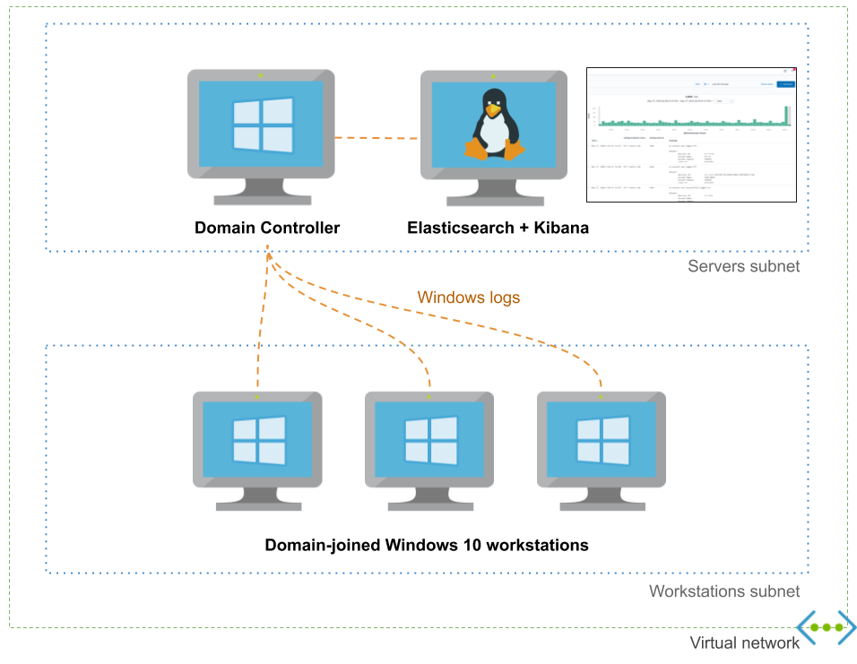
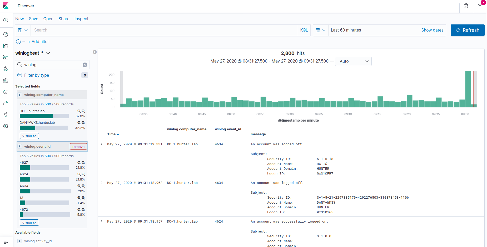
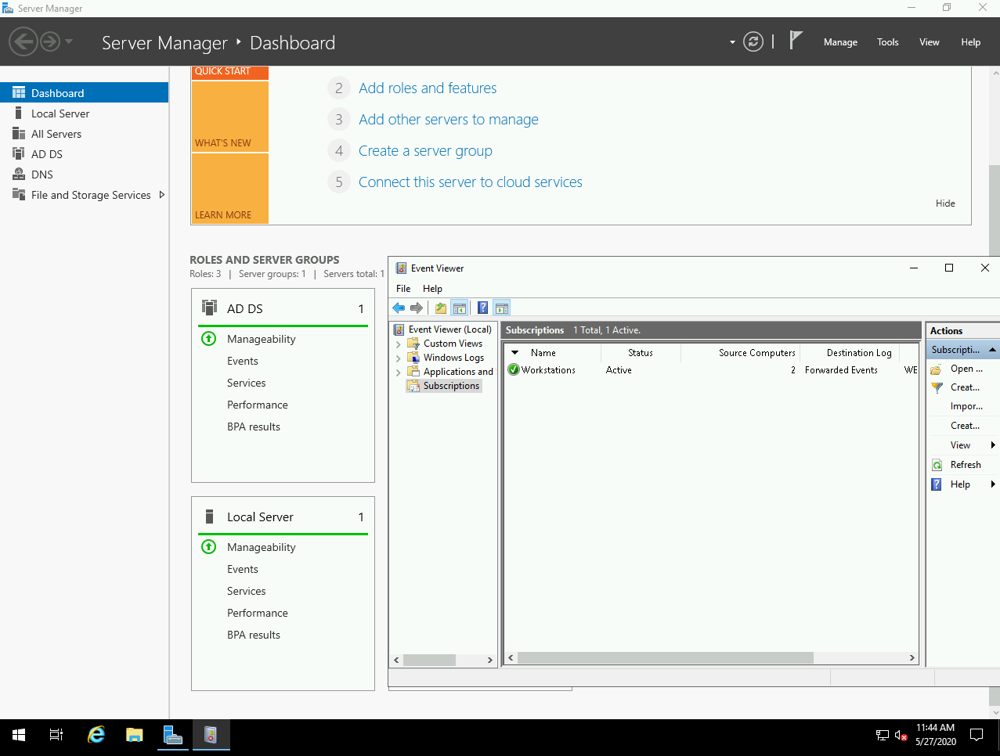

# Adaz: Active Directory Hunting Lab in Azure

 [](https://shields.io/)

This project allows you to **easily spin up Active Directory labs in Azure** with domain-joined workstations, Windows Event Forwarding, Kibana, and Sysmon using Terraform/Ansible.

<p align="center">
    
</p>

 It exposes a high-level configuration file for your domain to allow you to customize users, groups and workstations.

 ```yaml
dns_name: hunter.lab
dc_name: DC-1

initial_domain_admin:
  username: hunter
  password: MyAdDomain!

organizational_units: {}

users:
- username: christophe
- username: dany

groups:
- dn: CN=Hunters,CN=Users
  members: [christophe]

default_local_admin:
  username: localadmin
  password: Localadmin!

workstations:
- name: XTOF-WKS
  local_admins: [christophe]
- name: DANY-WKS
  local_admins: [dany]

enable_windows_firewall: yes
```

## Features

- Windows Event Forwarding pre-configured
- Audit policies pre-configured
- Sysmon installed
- Logs centralized in an Elasticsearch instance which can easily be queried from the Kibana UI
- Domain easily configurable via YAML configuration file

Here's an incomplete and biaised comparison with [DetectionLab](https://github.com/clong/DetectionLab):


|                                  |        Adaz       |    DetectionLab    |
|:--------------------------------:|:------------------:|:------------------:|
|       Public cloud support       |        Azure       |         AWS, *Azure ([beta](https://github.com/clong/DetectionLab/tree/master/Azure))*     |
| Expected time to spin up a lab   |     15-20 minutes     |     25 minutes     |
| Log management & querying        |     Elasticsearch+Kibana |     Splunk Enterprise     |
|                WEF               | :heavy_check_mark: | :heavy_check_mark: |
|          Audit policies          | :heavy_check_mark: | :heavy_check_mark: |
|              Sysmon              | :heavy_check_mark: | :heavy_check_mark: |
|  **YAML domain configuration file**  | :heavy_check_mark: |   :no_entry_sign:  |
|   **Multiple Windows 10 workstations support**   | :heavy_check_mark: |   :no_entry_sign:  |
|     VirtualBox/VMWare support    |   :no_entry_sign:  | :heavy_check_mark: |
|          osquery / fleet         |   :no_entry_sign:([vote!](https://github.com/christophetd/adaz/issues/10)) | :heavy_check_mark: |
|   Powershell transcript logging  |   :no_entry_sign: ([vote!](https://github.com/christophetd/adaz/issues/5))  | :heavy_check_mark: |
|   IDS logs |   :no_entry_sign: ([vote!](https://github.com/christophetd/adaz/issues/7))  | :heavy_check_mark: |


## Use-cases

- **Detection engineering**: Having access to clean lab with a standard is a great way to understand what traces common attacks and lateral movement techniques leave behind.

- **Learning Active Directory**: I often have the need to test GPOs or various AD features (AppLocker, LAPS...). Having a disposable lab is a must for this.

## Screenshots 





## Getting started 

### Prerequisites

- An Azure subscription. You can [create one for free](https://azure.microsoft.com/en-us/free/) and you get $200 of credits for the first 30 days. Note that this type of subscription has a limit of 4 vCPUs per region, which still allows you to run 1 domain controller and 2 workstations (with the default lab configuration).

- A SSH key in `~/.ssh/id_rsa.pub`. Your private key must either be added to ssh-agent (typically, by running `ssh-add ~/.ssh/id_rsa` once and adding `eval "$(ssh-agent -s)"` in your `.bashrc`) or not encrypted with a passphrase.

- [Terraform](https://www.terraform.io/downloads.html) >= 0.12

- [Azure CLI](https://docs.microsoft.com/en-us/cli/azure/install-azure-cli?view=azure-cli-latest)
- You must be logged in to your Azure account by running `az login`. Yu can use `az account list` to confirm you have access to your Azure subscription

### Installation

- Clone this repository

```
git clone https://github.com/christophetd/Adaz.git
```

- Create a virtual env and install Ansible dependencies

```bash
# Note: the virtual env needs to be in ansible/venv
python3 -m venv ansible/venv 
source ansible/venv/bin/activate
pip install -r ansible/requirements.txt
deactivate
```

- Initialize Terraform

```bash
cd terraform
terraform init
```

### Usage

Optionally edit [`domain.yml`](./domain.yml) according to your needs (reference [here](./doc/configuration_reference.md)), then run:

```
terraform apply
```

Resource creation and provisioning takes 15-20 minutes. Once finished, you will have an output similar to:

```
dc_public_ip = 13.89.191.140
kibana_url = http://52.176.3.250:5601
what_next =
####################
###  WHAT NEXT?  ###
####################

Check out your logs in Kibana:
http://52.176.3.250:5601

RDP to your domain controller:
xfreerdp /v:13.89.191.140 /u:hunter.lab\\hunter '/p:Hunt3r123.' +clipboard /cert-ignore

RDP to a workstation:
xfreerdp /v:52.176.5.229 /u:localadmin '/p:Localadmin!' +clipboard /cert-ignore


workstations_public_ips = {
  "DANY-WKS" = "52.165.182.15"
  "XTOF-WKS" = "52.176.5.229"
}
```

> Don't worry if during the provisioning you see a few messages looking like `FAILED - RETRYING: List Kibana index templates (xx retries left)`

By default, resources are deployed in the `West Europe` region under a resource group `ad-hunting-lab`. You can control the region with a Terraform variable:

```
terraform apply -var 'region=East US 2'
```

### Documentation

- [Frequently Asked Questions](./doc/faq.md)
- [`domain.yml` reference](./doc/configuration_reference.md)
- [Audit policies enabled](./doc/audit_policies.md)
- [Detailed architecture](./doc/architecture.md)
- [Troubleshooting common issues](./doc/troubleshooting.md)
- [Common Operations: adding users, destroying the lab, etc.](./doc/operations.md)
- [Project structure and directory organization](./doc/structure.md)
- [Terraform variables available](./terraform/vars.tf)

### Community

Talks / posts referencing Adaz:

- [Purple Teaming Cloud Identity: Simulation Labs for Red and Blue Teams](https://www.youtube.com/watch?v=xEn93_0jerk)
- [(French) HoneyWISE : stratégie d’exploitation d’honeytokens en environnement Active Directory](https://www.cesar-conference.org/wp-content/uploads/2020/12/CESAR2020_070_A-TOURNYOL-du-CLOS_HoneyWISE_v3.pdf)

### Roadmap

I will heavily rely on the number of thumbs up votes you will leave on [`feature-proposal` issues](https://github.com/christophetd/adaz/issues?q=is%3Aissue+is%3Aopen+label%3Afeature-proposal+sort%3Areactions-%2B1-desc) for the next features!

### Suggestions and bugs

Feel free to open an issue or to tweet [@christophetd](https://twitter.com/christophetd).

